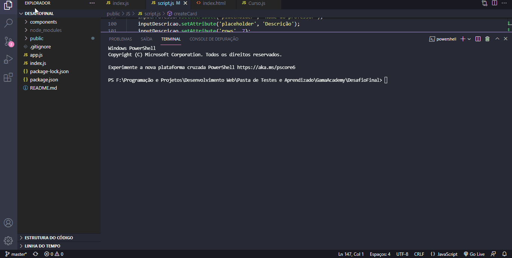

# GamaAcademyDesafioFinal

Olá, esse é o Desafio Final do projeto HSM Coders da Gama Academy!
O objetivo do projeto é testar os conhecimentos específicos do aluno em JavaScript. Além dos conhecimentos de Git.
Eis os requisitos mínimos: 

- Código entregue no Github.
- Função de criar curso.
- Função de exibir um curso escolhido.
- Função de atualizar um curso escolhido.
- Função de deletar um curso escolhido.
- Função de listar todos os cursos.

## Como iniciar a aplicação:

IMPORTANTE: Para testar as funções, é necessário que tenha o Node.js instalado no seu computador.
link para download do node: https://nodejs.org/en/

Clone este repositório ou faça o download do ZIP do código.

Acesse a pasta do projeto no terminal/cmd
`cd caminho-do-projeto`

Instale as dependências
`npm install`

Teste a aplicação
`npm start` 

## Projeto em execução: 

